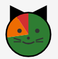

# MeowMorize

MeowMorize is a comprehensive flashcard application designed to help users effectively study and memorize information. Built with a robust Go backend and a dynamic React frontend, MeowMorize offers seamless interactions, efficient data management, and easy deployment using Docker.

Ok...that sounds impressive and kinda feels like the copy was created from Chat.  **It was!**  

There are two things that I was trying to acomplish here.

- **I wanted a flashcard app that I liked**.  Dont get me wrong, there are probably as many flashcard apps out there as to-do lists.  I seem to always find something I dont like about those too.  I actually use flashcards all the time.  My handwriting bites and I dont have the patience to craft nice ones.  

I LOVE [Obsidian](https://obsidian.md/). I love markdown.  I wanted an option to be able to create/curate my cards in markdown first. This app imports markdown!

- **Play with ChatGPT**. My job really does not allow for unfettered use of ChatGTP in coding. This is understandable for a cybersecurity company. But personal apps...have at it!

In a year ( its 2025), my little process will seem quaint.  I have yaml files to outline what files to concat so I can paste large chunks ( about 7k tokens ?) into the chat.  It works pretty well.  Copilot really doesnt work like that. Cursor does, but it seems like they have a little ways to go before I pay for another chat service. By the end of 2025, an agent will just take your full repo and suck it in.  It probably can now, but not as an affordable option for the unwashed masses.

An interesting twist that makes this project unique is the ability to bulk import cards from a chat friendly ( Markdown ) format.

## Markdown format of cards

```markdown
<!-- Card Start -->

### Front

[Question Here]

### Back

[Answer Here]

<!-- Card End -->
```

Tell chat to create 20 or so cards on your favorite subject using the above format.  It just works! This app understands this perfectly.  And you can edit cards on the fly in case there is an issue.  Its all done in Markdown.

[Here is my actual prompt](prompts/instructions.png)

[Here is a demo that you can import - Cat Jokes.  Really really bad Chat generated jokes](prompts/demoinput.md)

If you are studying for AWS certs, this can be a great too.
A good resource of practice exams are here: <https://github.com/kananinirav/AWS-Certified-Cloud-Practitioner-Notes/tree/master>

I used these as launching points to create cards.  With much more information to pull from
[](examples/kananinirav-22.md)

## App Overview


As you are browsing cards you can

- Flip ( see the other side)'
- Pass
- Skip ( kinda like a fail, I wanted a bump option)
- Fail

When you pass/skip/fail...it will mark that and move on.


A few things of note is the progress


You can see your progress as move along the deck.
When you finish, it will reshuffle the deck with the skips first then fails.


### Cat Pie chart



As part of the silliness, I did want a visualization to show how well you were doing with a particular card.  Pie charts bite.  But this one kinda works for me.  Its all in D3.js and is pretty much a stand alone React component if you want to just steal it.

## Architecture Overview

MeowMorize is composed of two main components:

- **Backend**: Implemented in Go using the Echo framework, the backend listens on port `8789` and manages the application's core functionalities, including user authentication, deck and card management, and session handling. Swagger documentation is available at `/swagger/index.html` for detailed API insights.

- **Frontend**: Developed with React, the frontend resides in the `/meowmorize-frontend` directory and listens on port `8999` as defined in the `.env` file. It provides an intuitive user interface for interacting with flashcards, importing data, and tracking study sessions.

The application leverages a SQLite database (`meowmorize.db`) located at the root directory for data persistence. To reset the application data, simply delete this database file.

### Importing Flashcards

MeowMorize supports importing flashcards using a special Markdown format tailored for chat-friendly interactions. Each flashcard must adhere to the following structure:

```markdown
<!-- Card Start -->

### Front

[Question Here]

### Back

[Answer Here]

<!-- Card End -->
```

**Optional**: Include a link related to the flashcard by adding the `<!--- Card Link --->` comment before the end comment:

```markdown
<!-- Card Start -->

### Front

[Question Here]

### Back

[Answer Here]

<!--- Card Link ---> https://example.com/resource

<!-- Card End -->
```

#### Steps to Import

1. **Prepare Your Markdown File**

   Ensure your flashcards are formatted correctly. Below is an example of 10 flashcards focusing on AWS Cloud certification topics related to AWS Lambda and AWS Step Functions:

   ```markdown
   <!-- Card Start -->
   ### Front
   What is AWS Lambda?
   
   ### Back
   AWS Lambda is a serverless compute service that lets you run code without provisioning or managing servers.
   
   <!-- Card End -->

   <!-- Card Start -->
   ### Front
   How do AWS Step Functions integrate with AWS Lambda?
   
   ### Back
   AWS Step Functions can coordinate multiple AWS Lambda functions into a workflow, managing state and transitions.
   
   <!-- Card End -->

   <!-- Add additional cards similarly -->
   ```

2. **Import via Frontend**

   - Navigate to the Import section in the frontend application.
   - Upload your Markdown file containing the flashcards.
   - The application will parse the file and add the flashcards to the selected deck.

## Project Status

This is still a work in progress and has a lot of work to go.  But its enough for me to study with and I will probably put features on hold.

A list of things I would like though

### Decks

- Decouple Decks from Cards:  The format in SQL is not super.  I did allow Chat some freedom, and would like to refactor things so that the decks/cards use a junction table.  

- Export to markdown would be nice.  The native format is a Json with UUIDs.

### Users/IAM

- Multiple users: The current app does have a login, but really there is only one user at a time. The session for a deck is basically a singleton in the domain service.  This needs to change, but that would require a whole IAM process too.  This would require ANOTHER junction table for the users to card relation too.

- Federation:  Okta/Cognito.  Something to this effect

### Advanced

- Use golang chain to update cards on the fly.

## Getting Started

### Running Locally

If you just want to run locally, you will need npm and golang.  Once all that is place

This will build the front end
```bash
./helper npm-build
```

you may need to generate or regenerate the swagger for the backend
```bash
./helper swagger
```

Swagger and mocks should be regenerated from time to time
```bash
./helper redoswagg
./helper mocks
```

This runs the backend...which is also serving up the front end on 8999

```bash
./helper run
```

point your browser to http://localhost:8999/


### Docker Deployment

MeowMorize is containerized using Docker, allowing for easy deployment and scalability. Below are the steps to deploy using Docker Compose.

#### Prerequisites

- **Docker**: [Install Docker](https://docs.docker.com/get-docker/)
- **Docker Compose**: [Install Docker Compose](https://docs.docker.com/compose/install/)


### Running from Docker

```js
docker pull rstave/meowmorize:latest
```


```js
docker run -d \
  -p 8999:8999 \
  --name meowmorize \
  -e DB_PATH=/app/data/db.sqlite3 \
  -e DEFAULT_USER_USERNAME=mycustomuser \
  -e DEFAULT_USER_PASSWORD=mycustompass \
  -e DEFAULT_USER_ROLE=mycustomrole \
  rstave/meowmorize:latest
```

### Building  from Docker


#### Steps to Deploy

1. **Build and Run Containers**

   From the project's root directory, execute:

```bash
   docker-compose up --build
```

  Can run detached with:

```bash
   docker-compose up -d
```

   This command will build Docker images for both the backend and frontend services and start the containers.

2. **Accessing the Services**

   - **Frontend**: Accessible at `http://localhost:8999`

3. **Managing the Containers**

   - **Stop Containers**

 ```bash
     docker compose down
```

   - **Rebuild Containers**

```bash
     docker compose up --build
```

4. **Pushing Docker Images**

   Utilize the helper script to build and push Docker images to Docker Hub:

   ( note...you will have to change a few things as the script currently pushes to my docker account)

```bash
   ./helper push-docker
```

   **Note**: Ensure you are logged in to Docker Hub before executing this command.

### Building locally

#### Prerequisites

- **Go**: Ensure Go is installed on your machine. [Download Go](https://golang.org/dl/)
- **Node.js & npm**: Required for the React frontend. [Download Node.js](https://nodejs.org/)
- **Docker & Docker Compose**: For containerized deployment. [Install Docker](https://docs.docker.com/get-docker/)
- **Swag**: For generating Swagger documentation.

  ```bash
  go install github.com/swaggo/swag/cmd/swag@latest
  ```

- **Mockery**: For generating mock files.

  ```bash
  go install github.com/vektra/mockery/v2@latest
  ```

#### Installation

1. **Clone the Repository**

   ```bash
   git clone https://github.com/yourusername/meowmorize.git
   cd meowmorize
   ```

( Skip to docker compose if your not interested in actually putting this together)

2. **Set Up the Backend**

   The backend is managed through the helper script located at the root of the project.

   - **Make the Helper Script Executable**

     ```bash
     chmod +x helper
     ```

   - **Run the Backend Application**

     ```bash
     ./helper run
     ```

     This command executes `go run cmd/main/main.go`, starting the backend server on port `8789`.

3. **Set Up the Frontend**

   Navigate to the frontend directory and install dependencies:

   ```bash
   cd meowmorize-frontend
   npm install
   ```

   **Run the Frontend Application**

   The front end is tied to the back with Golang using echo to serve both as the webserver and api.

   ```bash
   ./helper npm-build
   ```

   will build the front end

   ```bash
   ./helper run
   ``` 

   will run the go app

   The frontend will be accessible at `http://localhost:8999`.
 
 
### Building the Application

MeowMorize utilizes a helper script to streamline various build and deployment tasks. Below are the available commands and their descriptions:

```bash
./helper {run|concat|swagger|redoswagger|mocks|npm-build|npm-test|push-docker|test|help}
```

##### Commands

- **run**: Start the main backend application. ( and serve up the frontend)

  ```bash
  ./helper run
  ```

- **concat**: Concatenate files for Chat pasting purposes.

  ```bash
  ./helper concat
  ```

- **swagger**: Initialize Swagger documentation.

  ```bash
  ./helper swagger
  ```

- **redoswagger**: Regenerate Swagger documentation from the `cmd/main` directory.

  ```bash
  ./helper redoswagger
  ```

- **mocks**: Generate mock files for testing.

  ```bash
  ./helper mocks
  ```

- **npm-build**: Build the React frontend application.

  ```bash
  ./helper npm-build
  ```

 

- **npm-test**: Run JavaScript tests in the frontend.

  ```bash
  ./helper npm-test
  ```

- **push-docker**: Build and push Docker images for both backend and frontend.

  ```bash
  ./helper push-docker
  ```

- **test**: Execute backend tests.

  ```bash
  ./helper test
  ```

- **help**: Display usage information.

  ```bash
  ./helper help
  ```

## API Documentation

Comprehensive API documentation is available via Swagger at `http://localhost:8789/swagger/index.html`. It provides detailed information on all available endpoints, request parameters, and response structures.

## Running Tests

Ensure all dependencies are installed and run the following commands using the helper script:

- **Backend Tests**

  ```bash
  ./helper test
  ```

- **Frontend Tests**

  ```bash
  ./helper npm-test
  ```

## Notes

- **Database Reset**: To start fresh, simply delete the `meowmorize.db` file located at the root directory and restart the backend application.
- **Ports Configuration**: The frontend listens on port `8999` as specified in the `.env` file. Ensure this port is available or adjust the configuration as needed.
- **User Authentication**: The application initializes with a default user. Customize the username, password, and role using the `DEFAULT_USER_USERNAME`, `DEFAULT_USER_PASSWORD`, and `DEFAULT_USER_ROLE` environment variables (role defaults to `admin`).
- **JWT Secret**: Set the `JWT_SECRET` environment variable to the secret used for signing JWT tokens. The application will exit if this variable is missing.

## License

This project is licensed under the MIT License. See the [LICENSE](LICENSE) file for details.
